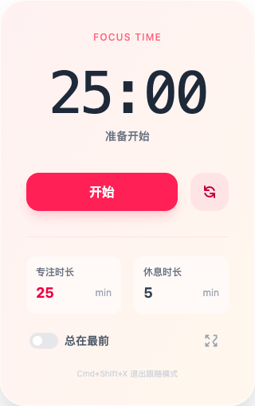

# Pomodoro Clock (番茄时钟)

A modern, feature-rich, and minimalist Pomodoro timer desktop application built with **Electron**, **React 19**, **TypeScript**, and **Tailwind CSS v4**.

## 📸 Screenshots

| Main Interface (Focus Mode) | Break Mode | Follow Mouse Mode |
|:---------------------------:|:----------:|:-----------------:|
|  |  |  |

## ✨ Features

### 🎨 Design Philosophy
- **Minimalism**: Borderless window design, focusing on core functionality. Hidden controls that appear on hover to reduce visual clutter.
- **Emotional Design**: 
  - **Focus Mode**: Warm gradients (Rose to Orange) to inspire energy and focus.
  - **Break Mode**: Cool gradients (Teal to Emerald) to promote relaxation.
  - **Micro-interactions**: Smooth transitions and hover effects for a delightful user experience.

### 🚀 Core Functionality
- **Standard Pomodoro Timer**: Customizable work and break sessions.
- **Follow Mouse Mode (Mini Mode)**: A unique, non-intrusive mode where a tiny timer follows your cursor.
  - The window becomes a "ghost" (ignores mouse events), allowing you to click through it.
  - Always stays on top of other windows.
- **Always on Top**: Toggle the main window to stay on top of other applications.
- **System Notifications**: Native system notifications when a session starts or ends.
- **Audio Feedback**: Simple, generated tones for timer completion (no external assets needed).

### ⌨️ Global Shortcuts
- `CommandOrControl+Shift+X`: **Exit Follow Mouse Mode** and restore the main window.

## 🛠 Tech Stack

- **Electron**: Cross-platform desktop application framework.
- **React 19**: The latest version of the UI library.
- **TypeScript**: Static typing for robust code.
- **Tailwind CSS v4**: Utility-first CSS framework (configured via `@tailwindcss/vite`).
- **Vite**: Ultra-fast build tool and development server.

## 🚀 Getting Started

### Prerequisites

Ensure you have **Node.js** and **pnpm** installed on your machine.

### Installation

Clone the repository and install dependencies:

```bash
git clone <repository-url>
cd pomodoro-clock
pnpm install
```

### Development

Start the development server with Hot Module Replacement (HMR):

```bash
pnpm dev
```

This will launch both the Vite server and the Electron application.

### Build

Build the application for production:

```bash
pnpm build
```

The output files will be in the `release/` directory.

## 📂 Project Structure

- `electron/`: Main process code (window management, system events).
- `src/`: Renderer process code (React UI, timer logic).
- `dist/`: Bundled Renderer files.
- `dist-electron/`: Compiled Main process files.
- `release/`: Packaged application installers.

## 📄 License

[MIT](LICENSE)
